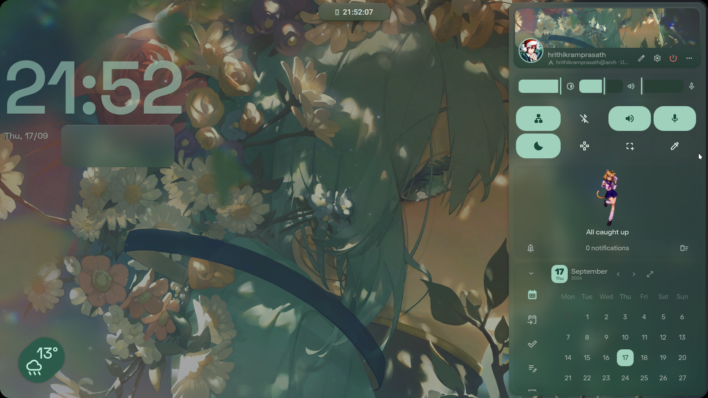
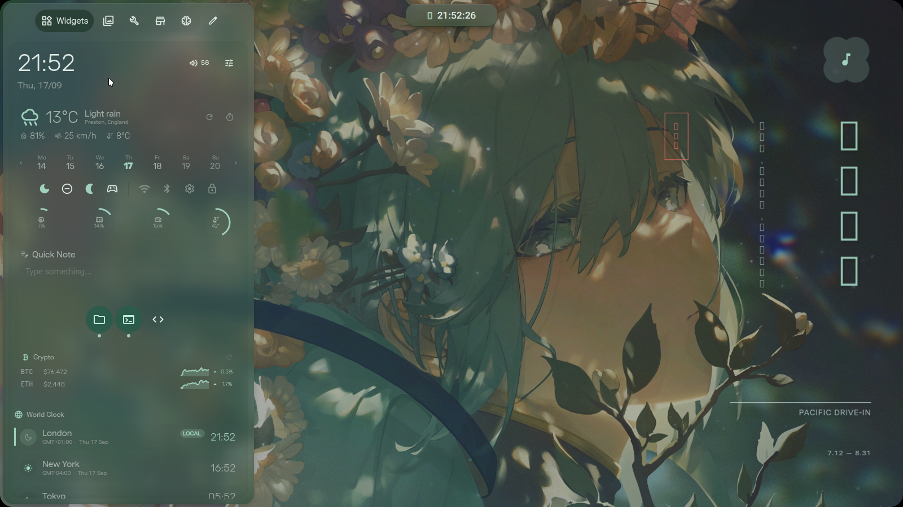
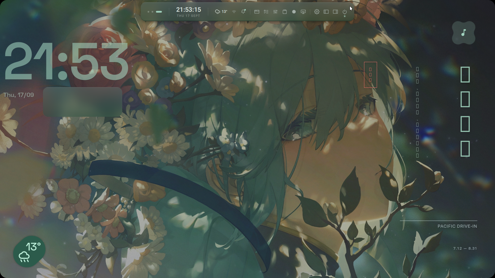
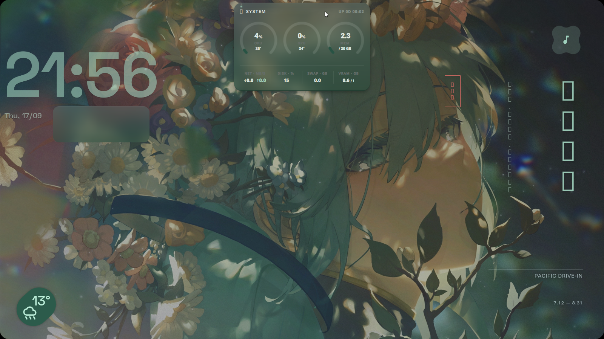

# Dotfiles

Personal configurations for Arch Linux with **Niri** (Wayland scrollable tiling compositor) and **iNiR** (Quickshell desktop shell).

## 📸 Desktop Showcase

| Desktop & Right Control Panel | Widgets Panel & Typography |
| :---: | :---: |
|  |  |
| *Right sidebar: System controls, notifications & calendar* | *Left sidebar: Hardware meters, crypto, notes & world clock* |

| Expanded Pill Status Bar | Hardware Monitor Dropdown |
| :---: | :---: |
|  |  |
| *Top pill bar: Workspaces, clock, weather & trays* | *Hardware monitor: Live CPU, GPU, RAM & VRAM gauges* |

## Components & Structure

```
.
├── .config/
│   ├── niri/             # Niri compositor config, modular rules & keybinds
│   ├── inir/             # iNiR Quickshell shell preferences, themes & actions
│   ├── kitty/            # Kitty terminal configuration & themes
│   ├── fish/             # Fish shell config, aliases & environment
│   ├── starship.toml     # Starship prompt configuration
│   ├── fastfetch/        # Fastfetch system info styling
│   ├── cava/             # Cava audio visualizer
│   ├── matugen/          # Material You dynamic wallpaper theming
│   ├── Kvantum/          # Kvantum Qt style config
│   ├── qt6ct/            # Qt6 settings & styling
│   ├── gtk-3.0/          # GTK3 theme, font, icon settings
│   ├── gtk-4.0/          # GTK4 theme, font, icon settings
│   ├── darklyrc          # Darkly Qt widget style options
│   ├── fontconfig/       # Font configurations
│   ├── mimeapps.list     # Default application associations
│   ├── chrome-flags.conf # Wayland & ozone flags for Google Chrome
│   └── code-flags.conf   # Wayland flags for VS Code
├── packages-repo.txt     # Explicitly installed official Arch packages
├── packages-aur.txt      # Explicitly installed AUR packages
├── .gitignore
├── install.sh            # Deployment / restoration script
└── README.md
```

## Key Applications & Stack

* **Compositor**: Niri (Scrollable tiling Wayland compositor)
* **Desktop Shell**: iNiR (Quickshell / Qt6 QML interface)
* **Terminal**: Kitty
* **Shell Environment**: Fish + Starship
* **Browser**: Google Chrome
* **Media Player**: mpv + mpv-mpris
* **Screen Recorder**: wf-recorder
* **Snipping & OCR**: iNiR Region Tool (grim + slurp + swappy)
* **Color Picker**: hyprpicker
* **App Launcher**: iNiR Overview (`Mod+Space`)

## Installation & System Recovery

### Option 1: Quick Config Symlink (Existing System)
If packages and iNiR are already installed and you just want to apply or update configurations:

```bash
git clone https://github.com/hrithikramprasath/dotfiles.git ~/dotfiles
cd ~/dotfiles
./install.sh
```

### Option 2: Full System Recovery (Fresh PC Reset)
If you just reinstalled Arch Linux and want to recreate your exact setup:

```bash
git clone https://github.com/hrithikramprasath/dotfiles.git ~/dotfiles
cd ~/dotfiles
./install.sh --full
```
This will automatically:
1. Reinstall all official Arch packages from `packages-repo.txt`
2. Bootstrap `yay` and install all AUR packages from `packages-aur.txt`
3. Clone and configure the `iNiR` desktop shell
4. Symlink all `.config/` directories into place

## License

This project is licensed under the [MIT License](LICENSE).
Copyright (c) 2026 Hrithik Ram Prasath. Anyone using, copying, or distributing these configurations must retain the original copyright and permission notice.

