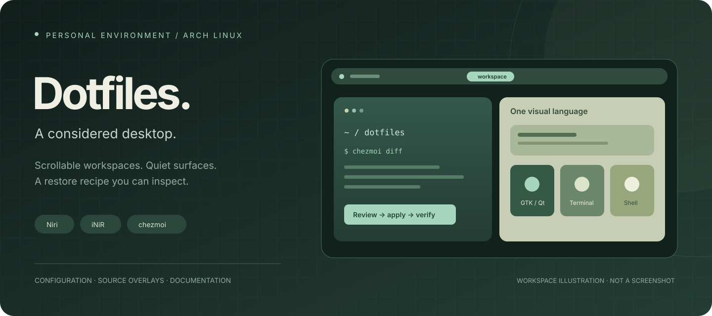
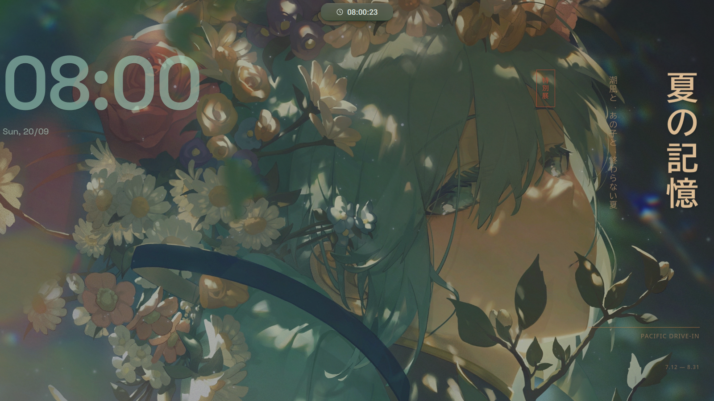
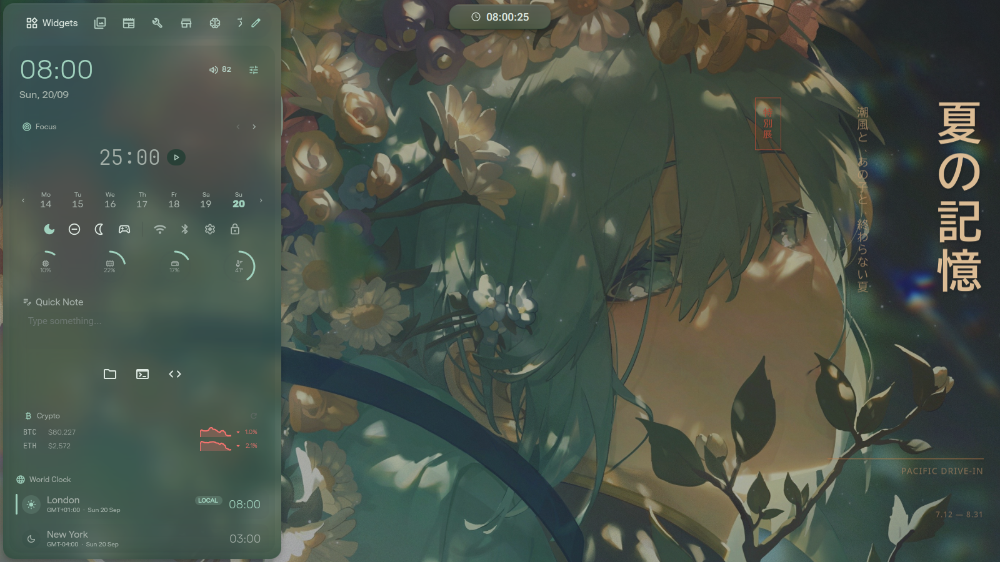
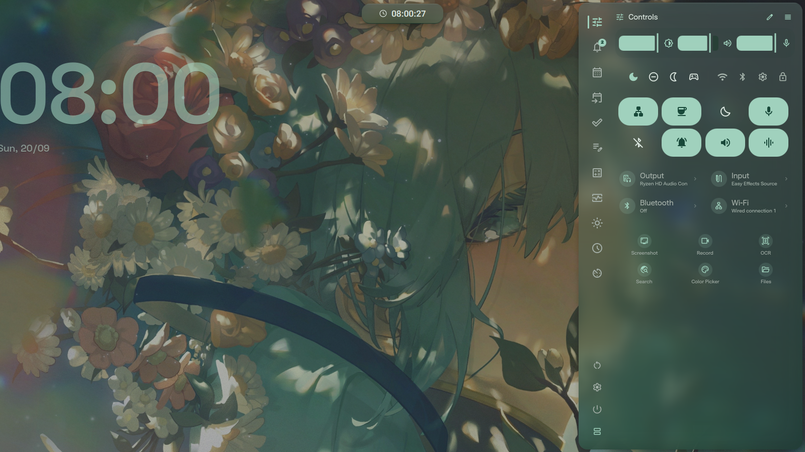
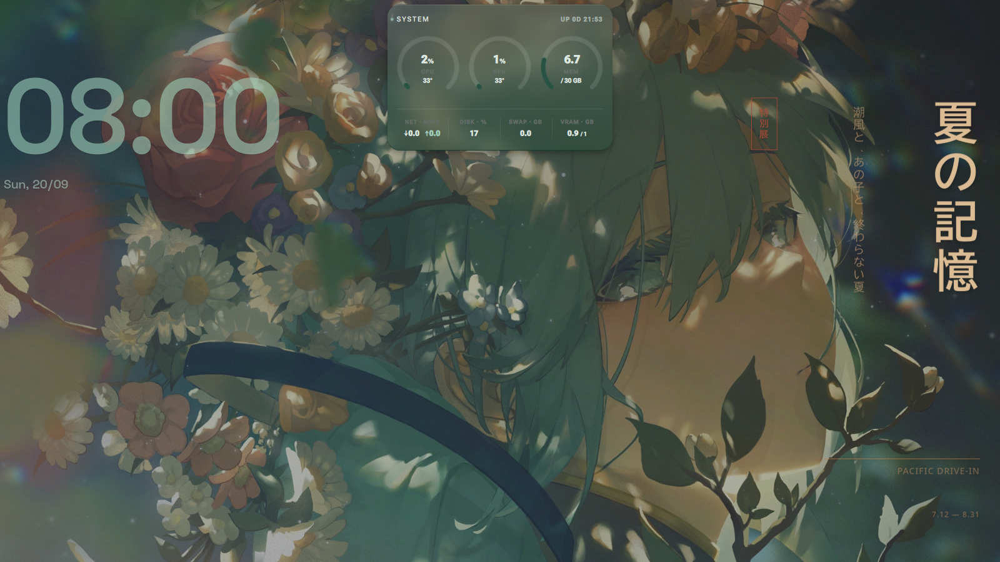
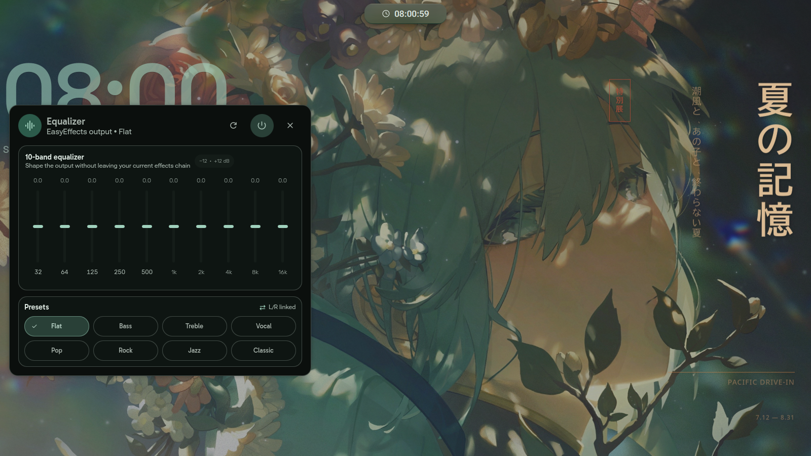
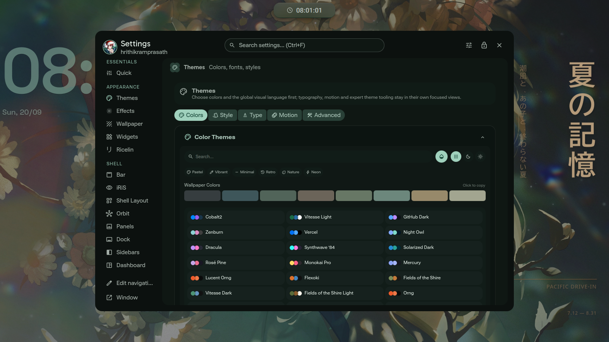
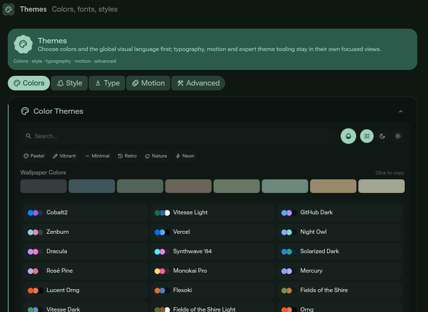
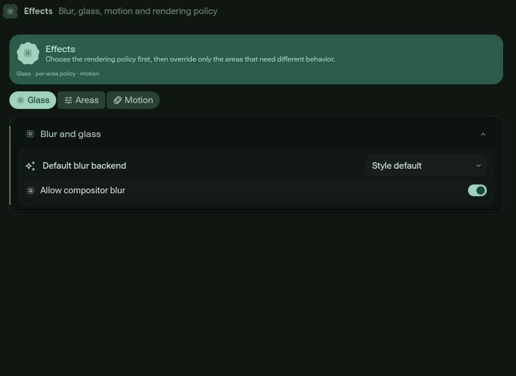
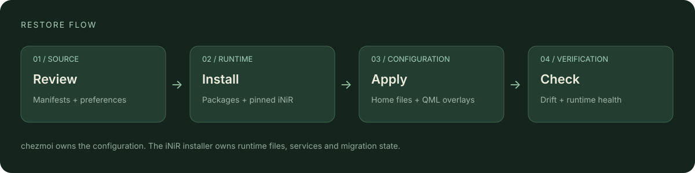

<p align="center">
  
</p>

# Arch / Niri dotfiles

[](https://github.com/hrithikramprasath/dotfiles/actions/workflows/validate.yml)

A personal Wayland desktop with scrolling workspaces, floating controls, and
wallpaper-derived colors across the shell, terminal and GTK/Qt apps. Managed with
[chezmoi](https://www.chezmoi.io/), built around [Niri](https://github.com/niri-wm/niri)
and [iNiR](https://github.com/snowarch/inir).

**[Install](docs/installation.md) · [Maintain](docs/maintenance.md) ·
[Review & compatibility](docs/review-2026-09-20.md) · [Attribution](THIRD_PARTY.md)**

This is a personal restore recipe for an existing Arch Linux installation.
Review the package lists and preferences before applying it to another machine.
The repository contains selected iNiR source overlays, not a complete shell.

## The desktop



A quiet workspace with a compact top bar, a large desktop clock and Japanese
Typography widgets. The wallpaper palette carries through the translucent panels
and controls. These are real **1600 × 900 captures of iNiR 2.31.0**; click an image
to inspect it at full size.

### Side panels

| Left · widgets and shortcuts | Right · compact control center |
| --- | --- |
|  |  |

The left panel combines a focus timer, week strip, system usage rings, quick notes,
app shortcuts and world clocks. Its tabs also lead to wallpaper browsing, tools
and other services. The right panel groups brightness and audio sliders, quick
toggles, device selection and screenshot, recording, OCR and color-picker actions.
The compact layout keeps calendar and other tools in a vertical tab rail.

### Floating tools

| Pill · system monitor | EasyEffects · output equalizer |
| --- | --- |
|  |  |

The pill expands in place for a quick view of resource use. The optional equalizer
exposes ten bands and common presets without opening the full EasyEffects window.
Both sit above the desktop rather than becoming tiled app windows.

### Settings in context



Settings bring colors, effects, widgets, panel layout and compositor preferences
into one searchable interface. The existing close-ups below show the individual
controls more clearly.

## A closer look

| Wallpaper-derived palettes | Glass and rendering controls |
| --- | --- |
|  |  |

Captured on **20 September 2026**. The full desktop gallery uses an empty
workspace, the compact right sidebar, hidden weather location and a hidden idle
visualizer; personal preferences were restored afterward. Notifications, clipboard
contents and private app windows are not shown. The two close-ups above are from
the earlier 2.30 configuration. The opening vector is an illustration.

## The stack

| Layer | Configuration |
| --- | --- |
| Desktop | Niri + Quickshell / iNiR; modular compositor rules and custom QML overlays |
| Terminal | Kitty, Fish and Starship; shared Bash/Zsh login environment |
| Appearance | Wallpaper-driven Material You palette; GTK, Qt, Darkly and Kvantum |
| Utilities | Clipboard history, screenshots/OCR, mpv, Cava and EasyEffects |
| Restore | chezmoi templates, checksummed font downloads and pinned iNiR bootstrap |

## Get started

```bash
git clone https://github.com/hrithikramprasath/dotfiles.git ~/dotfiles
cd ~/dotfiles
# Review packages-repo.txt, packages-aur.txt and the configuration first.
./install.sh --full
```

`--full` installs the desktop, its tools and appearance assets, then configures the
ii-pixel login screen and next-login services. Run it as a normal user with sudo
on a **booted Arch installation** with networking and GPU drivers ready. It uses
`pacman -Syu`; it does not choose kernels or install `packages-apps.txt`.
After success, reboot and select **Niri** in SDDM. Follow the
[fresh-install guide](docs/installation.md) for prerequisites and verification.

Already have iNiR installed? Start with `./install.sh --diff`, then use
`./install.sh --configs-only` when the changes are right. See the
[installation guide](docs/installation.md) for prerequisites and exact behavior.



## Everyday controls

`Super` is the configured Niri modifier.

| Shortcut | Action |
| --- | --- |
| `Super + Enter` | Terminal |
| `Super + Space` | iNiR overview / launcher |
| `Super + V` | Clipboard history |
| `Super + ,` | Settings |
| `Super + Shift + S` | Screenshot / region menu |
| `Super + /` | Full shortcut reference |
| `Alt + Tab` | Niri's recent-window switcher |

The complete bindings live in
[`70-binds.kdl`](dot_config/niri/config.d/70-binds.kdl).

## What lives where

| Path | Purpose |
| --- | --- |
| `dot_config/` | Managed application configuration under `~/.config` |
| `dot_config/quickshell/inir/` | 32 selected runtime overlays: 29 QML files and three scripts |
| `dot_profile`, `dot_bash*`, `dot_z*` | Login environment and interactive shell setup |
| `private_dot_local/state/`, `private_dot_local/share/color-schemes/` | Curated appearance palette and Qt colors; no histories |
| `private_dot_local/bin/executable_inir.tmpl` | Deploys the patched launcher from the same source as the runtime copy |
| `.chezmoiscripts/` | Repeatable desktop package setup and post-restore login/service checks |
| `.chezmoiexternal.toml` | Pinned font downloads and their licenses |
| `inir-revision.txt` | Tested base for fresh iNiR installs |
| `scripts/`, `tests/`, `.github/workflows/` | Offline validation and automation; never deployed into the home directory |
| `docs/`, `assets/` | Guides, review notes and documentation images |

## Validation and compatibility

```bash
python3 scripts/validate.py
python3 -m unittest discover -s tests -v
```

The validator checks configuration syntax, shader/QML parsing, local documentation
links and a restore into a temporary home. The behavior suite has **22 tests**.
Dependencies and runtime checks are in the [maintenance guide](docs/maintenance.md).
The [GitHub Actions workflow](.github/workflows/validate.yml) runs these checks on
pushes to `main`, pull requests and manual dispatch, without running the install hook.

The tested base is **iNiR 2.31.0 / `9574fa42`**, with the custom overlays migrated
and an optional-environment startup fix included in the launcher. See the
[upgrade report](docs/upgrade-2.31.md) for validation, recovery and the remaining
system-level SDDM migration. Hardware-specific features and every possible desktop
interaction have not been verified.

## Credits and license

Original repository work uses [MIT](LICENSE). iNiR-derived source retains
[GPL-3.0](LICENSES/GPL-3.0.txt); other assets retain their own terms. See
[third-party attribution](THIRD_PARTY.md) for scope and provenance.
